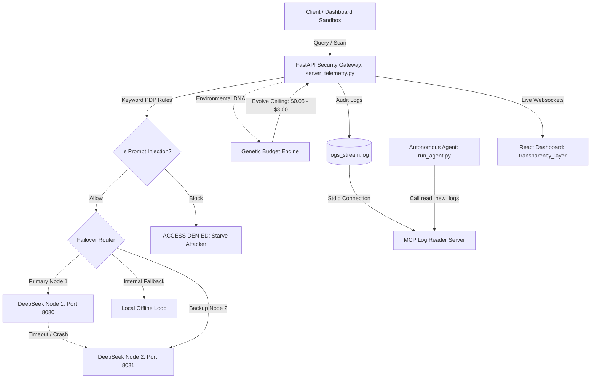

# OtariGuard FinOps: Evolutionary Cost Control & Security Gateway

OtariGuard FinOps is an advanced security and cost optimization layer built on top of **Mozilla Otari** and the **Mozilla any-agent** framework. 

Traditional LLM gateways rely on static budget limits (e.g., a hard $2 limit per key). In high-volume environments, this creates two severe failure modes:
1. **AI Starvation Attacks:** Attackers spam prompt injections or automated queries to deplete the budget, causing a denial of service (DoS) for legitimate users.
2. **Uptime Failures:** Legitimate high-traffic spikes trigger static budget caps, prematurely cutting off services.

**OtariGuard FinOps** solves this by implementing **Evolutionary FinOps**—using a Genetic Algorithm to evolve LLM budget ceilings in real-time based on live infrastructure health and threat telemetry.

---

## 🚀 Key Features

* **Genetic Budget Engine:** Dynamically evolves the budget limit between **$0.05** (floor/starvation mode during DDoS attacks) and **$3.00** (ceiling/survival mode during critical legitimate load), returning to a **$2.00** baseline under normal operations.
* **Resilient Multi-Node Failover:** A dual-client router (`server_telemetry.py`) that monitors the primary local model node (port `8080`) and automatically fails over to the backup node (port `8081`) or an offline local safety loop if downstream servers crash.
* **Autonomous Security Agent:** Built with **Mozilla any-agent (TinyAgent)** and **Model Context Protocol (MCP)**, running in the background to automatically seek, read, and audit server log files for bypass anomalies.
* **Transparency Dashboard:** A React + Vite frontend visualization layer displaying live hardware metrics, budget gauge consumption, active failover nodes, dynamic policy rules, and a visual breeder layout for current chromosome populations.
* **Developer Sandbox:** Includes a traffic replay simulation harness to load pre-recorded threat logs (`sample_traffic.json`) and verify how the Genetic Algorithm responds to DDoS waves.

---

## 🛠️ System Architecture



---

## 📦 Tech Stack

### **Core AI Gateway & Routing**
* **Mozilla Otari Gateway:** The host proxy wrapper for model endpoint configurations and keys.
* **Mozilla any-agent (TinyAgent):** The execution loop runner for the autonomous security auditor.
* **Model Context Protocol (MCP):** Stdio communication protocol linking logs with agent tools.

### **Backend Frameworks**
* **FastAPI:** Asynchronous API routing engine.
* **Uvicorn:** ASGI hosting server.
* **Socket.IO (python-socketio):** Real-time web socket server broadcasting telemetry data.
* **SQLite:** Local DB tracking Otari parameters.

### **Frontend & Visuals**
* **React.js + Vite:** Development template and layout layer.
* **Recharts:** Live graphing for hardware/gateway performance and cost indexes.
* **Lucide React:** Icons library.
* **Vanilla CSS:** Custom cyberpunk animations, grid visuals, and dark mode interface.

---

## 🏁 Getting Started

### 1. Prerequisites
Ensure you have Python (3.11+), Node.js, and npm installed on your system.

### 2. Backend & Mock Log Setup
Clone the repository and install dependencies:
```bash
# Sync Python packages
uv sync --dev
```

Start the **FastAPI + Socket.IO Telemetry Gateway**:
```bash
python server_telemetry.py
```
*Runs on `http://127.0.0.1:5000`*

Start the **Realistic Log Generator** in a separate terminal:
```bash
python mock_log_generator.py
```
*Generates 5 distinct traffic phases (Normal -> Buildup -> DDoS -> Recovery -> High Load).*

---

### 3. Frontend Transparency Layer Dashboard Setup
Navigate to the dashboard directory, install Node dependencies, and start the development server:
```bash
cd transparency_layer
npm install
npm run dev
```
*Open `http://localhost:5173` in your browser.*

---

### 4. Running the MCP Server & Autonomous Security Agent
Run the standard Model Context Protocol (MCP) server daemon:
```bash
python -m mcp_log_reader
```
*Exposes the `read_new_logs` tool.*

Execute the autonomous agent loop:
```bash
python run_agent.py
```
*Continually checks new log segments to audit and flag suspicious prompts.*

---

## 📂 Project Directory Structure

```text
├── any-agent/              # Mozilla any-agent SDK codebase
├── otari/                  # Mozilla Otari Gateway core repository
├── transparency_layer/     # React + Vite frontend source code
│   ├── src/
│   │   ├── components/     # Visual panels (Breeder, ThreatPulse, BudgetEnforcer)
│   │   ├── services/       # Socket.IO connection manager
│   │   └── App.jsx         # Main dashboard layout wrapper
│   └── package.json
├── genetic_budget_engine.py# Evolutionary FinOps Genetic Algorithm logic
├── server_telemetry.py    # FastAPI Telemetry and Node Failover router
├── mock_log_generator.py   # Simulates live network logging cycles
├── run_agent.py            # Executes autonomous TinyAgent loop
├── logs_stream.log         # Active logging channel read by MCP
└── mcp_log_reader/         # Python Model Context Protocol Log Server
```

---

## 🛡️ License
Distributed under the Apache-2.0 License. See `LICENSE` for more information.
